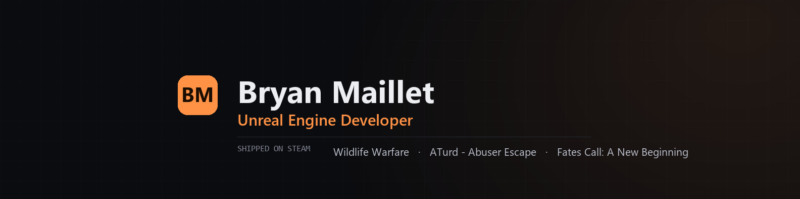

I build gameplay systems for Unreal Engine games, then make them run fast.

Three titles shipped on Steam since 2021, across five studios. Blueprint and C++, multiplayer, VR, and the profiling and optimisation work that follows. I started in level design and lighting and moved toward systems as the projects got bigger, so I'm comfortable on either side of that conversation.

## Shipped

| Title | Year | What I did |
|---|---|---|
| [Wildlife Warfare](https://store.steampowered.com/app/3130720/Wildlife_Warfare/) | 2024 | UE5 asymmetric multiplayer PvP. Level design, sound and VFX, rendering and optimisation |
| [ATurd - Abuser Escape](https://store.steampowered.com/app/2023680/ATurd__Abuser_Escape/) | 2022 | Third-person search-and-escape. Level design, 3D modelling, lighting, LOD and HLOD setup |
| [Fates Call: A New Beginning](https://store.steampowered.com/app/691090/Fates_Call_A_New_Beginning/) | 2021-22 | VR action RPG. VR level design, progression and interaction, rendering and optimisation for Oculus |

## What's here

Most of my work is studio projects under other people's names, so it isn't mine to publish. What is here are small, self-contained Unreal pieces, each one a thing I end up building on most projects:

- [InventorySystemUE5BP](https://github.com/agentfufu/InventorySystemUE5BP): interface-driven inventory, items and weapons as pickups
- [HealthSystemUE5BP](https://github.com/agentfufu/HealthSystemUE5BP): health and damage through one interface, with screen feedback
- [BasicCameraMovementUE5-BP-](https://github.com/agentfufu/BasicCameraMovementUE5-BP-): runtime camera switching, possession and shake
- [Day-NightCycleUE5](https://github.com/agentfufu/Day-NightCycleUE5): configurable day and night cycle
- **portfolio**: my site. Plain HTML, CSS and JavaScript, no build step, plus the Python and Node tools that generate its images and sitemap.

Next up: VR comfort settings and a frame-budget checklist for Quest and PC VR, pulled from the shipped work.

## Elsewhere

- Portfolio: coming soon
- LinkedIn: coming soon
- [Upwork](https://www.upwork.com/freelancers/~01b90dd8047cd8198e): 100% Job Success across 536 hours of client work
- Email: Bfufu@protonmail.com
